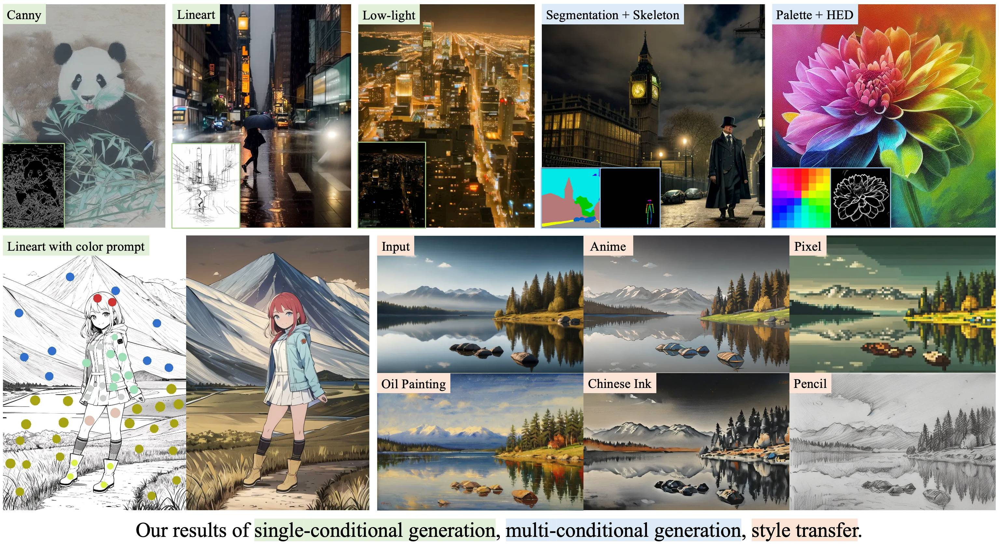
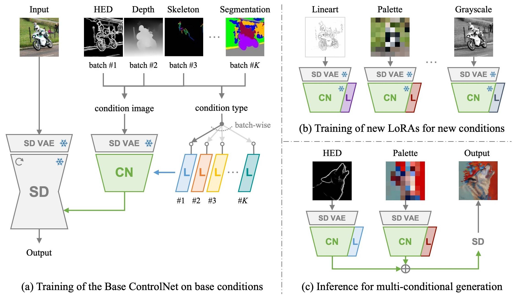
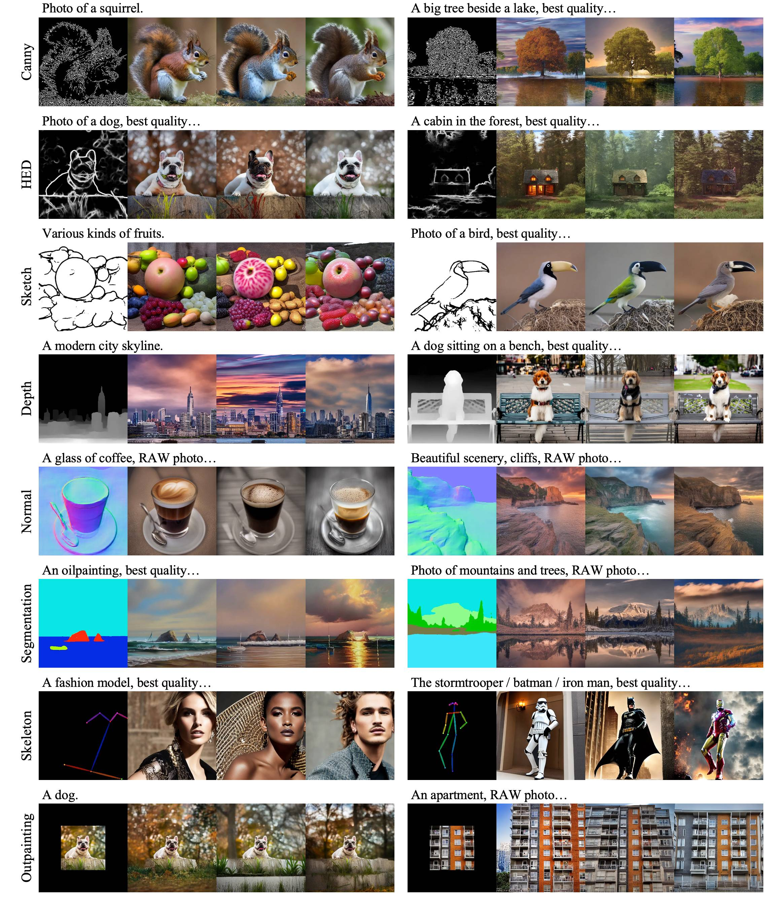
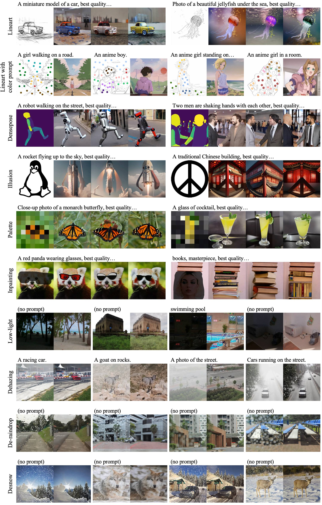
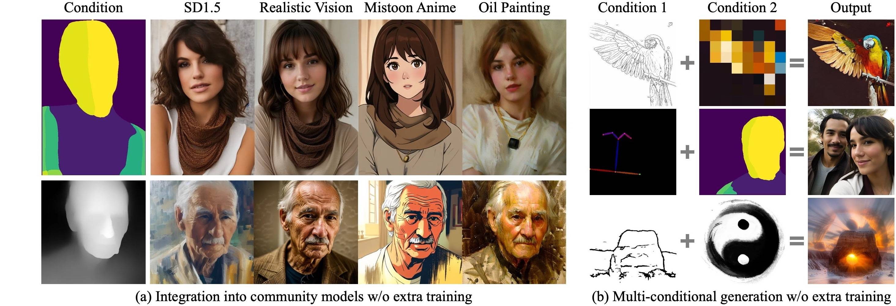
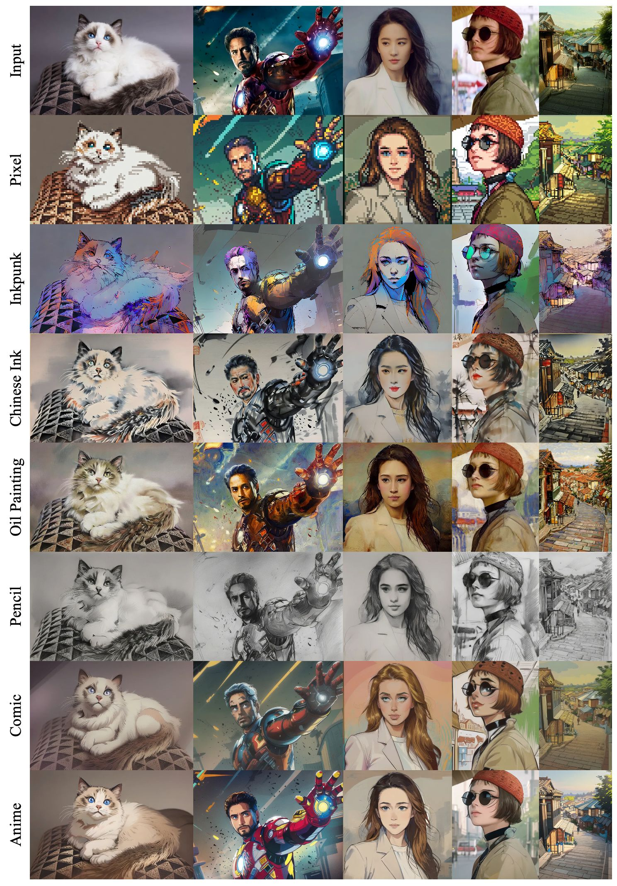
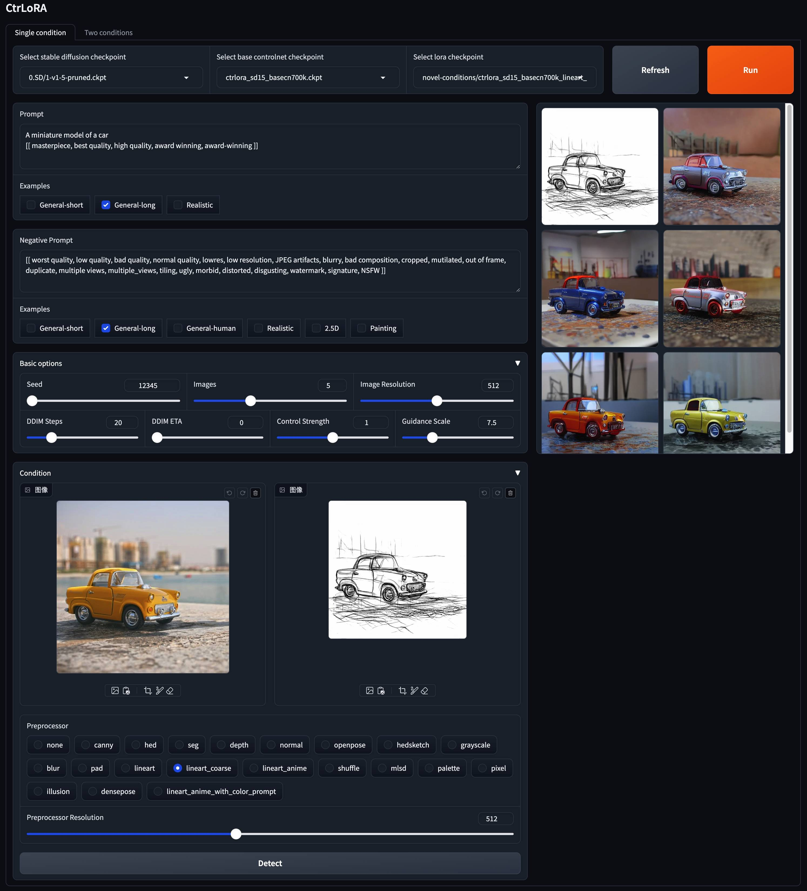
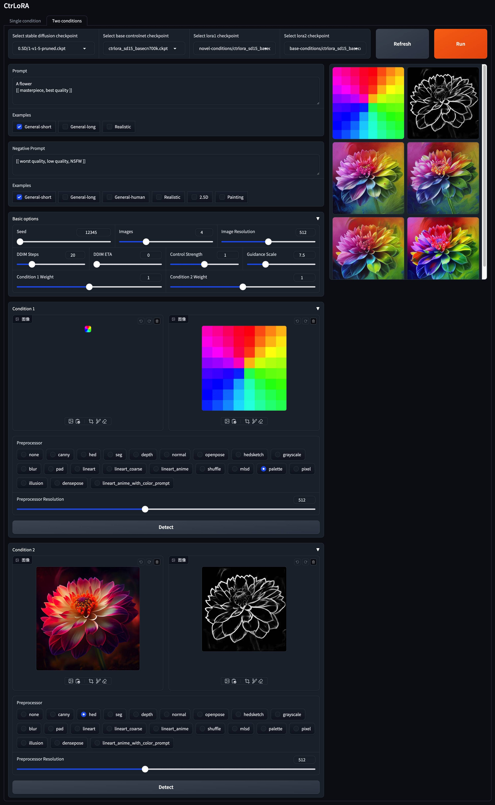

## To create your customized ControlNet in an easy and low-cost manner 🎉
<p align="center">
    
</p>

<p align="center">
    
</p>

*The images are compressed for loading speed.*

<h1 align="center"> 
    <a href="https://arxiv.org/abs/2410.09400">CtrLoRA</a>
</h1>

<a href="https://arxiv.org/abs/2410.09400"></a>
<a href="https://huggingface.co/xyfJASON/ctrlora/tree/main"></a>

> **[CtrLoRA: An Extensible and Efficient Framework for Controllable Image Generation](https://arxiv.org/abs/2410.09400)** \
> [Yifeng Xu](https://xyfjason.github.io/homepage)<sup>1,2</sup>, [Zhenliang He](https://lynnho.github.io)<sup>1</sup>, [Shiguang Shan](https://scholar.google.com/citations?user=Vkzd7MIAAAAJ)<sup>1,2</sup>, [Xilin Chen](https://scholar.google.com/citations?user=vVx2v20AAAAJ)<sup>1,2</sup> \
> <sup>1</sup>Key Lab of AI Safety, Institute of Computing Technology, CAS, China \
> <sup>2</sup>University of Chinese Academy of Sciences, China


<p align="center">
    
</p>

We first train a **Base ControlNet** along with **condition-specific LoRAs** on base conditions with a large-scale dataset. Then, our Base ControlNet can be efficiently adapted to novel conditions by new LoRAs with <mark>10% parameters, as few as 1,000 images, and less than 1 hour training on a single GPU</mark>. 


## 📜 Contents
- [🎨 Visual Results](#-visual-results)
- [🛠️ Installation](#%EF%B8%8F-installation)
- [🤖️ Download Pretrained Models](#%EF%B8%8F-download-pretrained-models)
- [🚀 Gradio Demo](#-gradio-demo)
- [🚗 Python API](#-python-api)
- [🔥 Train a LoRA for Your Custom Condition](#-train-a-lora-for-your-custom-condition)
- [📚 Detailed Instructions](#-detailed-instructions)


## 🎨 Visual Results

### 🎨 Controllable generation on "base conditions"

||
|-|

### 🎨 Controllable generation on "novel conditions"

||
|-|


### 🎨 Integration into community models & Multi-conditional generation

||
|-|

### 🎨 Application to style transfer

||
|-|


## 🛠️ Installation

Clone this repo:

```shell
git clone --depth 1 https://github.com/xyfJASON/ctrlora.git
cd ctrlora
```

Create and activate a new conda environment:

```shell
conda create -n ctrlora python=3.10
conda activate ctrlora
```

Install pytorch and other dependencies:

```shell
pip install torch==1.13.1+cu117 torchvision==0.14.1+cu117 torchaudio==0.13.1 --extra-index-url https://download.pytorch.org/whl/cu117
pip install -r requirements.txt
```


## 🤖️ Download Pretrained Models

We provide our pretrained models [here](https://huggingface.co/xyfJASON/ctrlora/tree/main). Please put the **Base ControlNet** (`ctrlora_sd15_basecn700k.ckpt`) into `./ckpts/ctrlora-basecn` and the **LoRAs** into `./ckpts/ctrlora-loras`.
The naming convention of the LoRAs is `ctrlora_sd15_<basecn>_<condition>.ckpt` for base conditions and `ctrlora_sd15_<basecn>_<condition>_<images>_<steps>.ckpt` for novel conditions.

You also need to download the **SD1.5-based Models** and put them into `./ckpts/sd15`. Models used in our work:

- Stable Diffusion v1.5 (`v1-5-pruned.ckpt`): [official](https://huggingface.co/runwayml/stable-diffusion-v1-5/tree/main) / [mirror](https://huggingface.co/stable-diffusion-v1-5/stable-diffusion-v1-5/tree/main)
- [Realistic Vision](https://civitai.com/models/4201/realistic-vision-v60-b1)
- [Dreamshaper](https://civitai.com/models/4384/dreamshaper)
- [Mistoon Anime](https://civitai.com/models/24149?modelVersionId=348981)
- [Comic Babes](https://civitai.com/models/20294/comic-babes)
- [Oil Painting](https://civitai.com/models/20184/oil-painting)
- [Inkpunk](https://civitai.com/models/1087/inkpunk-diffusion?modelVersionId=1138)
- [Chinese Ink Comic-strip](https://civitai.com/models/148239/or-chinese-ink-comic-strip)
- [Slate Pencil Mix](https://civitai.com/models/389528/slatepencilmix)
- [Aziib Pixel Mix](https://civitai.com/models/195730/aziibpixelmix)


## 🚀 Gradio Demo

```shell
python app/gradio_ctrlora.py
```
*Requires at least 9GB/21GB GPU RAM to generate a batch of one/four 512x512 images.*

<details><summary><strong>Single-conditional generation</strong></summary>

1. select the Stable Diffusion checkpoint, Base Controlnet checkpoint and LoRA checkpoint.
2. write prompts and negative prompts. We provide several commonly used prompts.
3. prepare a condition image
    + upload an image to the left of the "Condition" panel, select the preprocessor corresponding to the LoRA, and click "Detect".
    + or upload the condition image directly, select the "none" preprocessor, and click "Detect".
4. click "Run" to generate images.
5. *if you upload any new checkpoints, restart gradio or click "Refresh".*



</details>


<details><summary><strong>Multi-conditional generation</strong></summary>



</details>


<details><summary><strong>Application to style transfer</strong></summary>

1. select a [stylized Stable Diffusion](#%EF%B8%8F-download-pretrained-models) checkpoint to specify the target style, e.g., Pixel.
2. select the Base ControlNet checkpoint.
3. select **palette** for the LoRA1 checkpoint and **lineart** for the LoRA2 checkpoint.
   + *palette + canny or palette + hed also work, maybe there are more interesting combinations to be discovered*
4. write prompts and negative prompts.
5. upload the source image to the "Condition 1" panel, select the **"none"** preprocessor, and click "Detect".
6. upload the source image to the "Condition 2" panel, select the **"lineart"** preprocessor, and click "Detect".
7. adjust the weights for the two conditions in the "Basic options" panel.
8. click "Run" to generate images.


</details>


## 🚗 Python API

Besides the Gradio demo, you can also sample images with the following Python code.

### 🚗 Single-conditional generation

```python
from api import CtrLoRA

ctrlora = CtrLoRA(num_loras=1)
ctrlora.create_model(
    sd_file='ckpts/sd15/v1-5-pruned.ckpt',
    basecn_file='ckpts/ctrlora-basecn/ctrlora_sd15_basecn700k.ckpt',
    lora_files='ckpts/ctrlora-loras/novel-conditions/ctrlora_sd15_basecn700k_inpainting_brush_rank128_1kimgs_1ksteps.ckpt',
)
samples = ctrlora.sample(
    cond_image_paths='assets/test_images/inpaint_cat.png',
    prompt='A cat wearing a brown cowboy hat, best quality',
    n_prompt='worst quality',
    num_samples=1,
)
samples[0].show()
```

### 🚗 Multi-conditional generation

```python
from api import CtrLoRA

ctrlora = CtrLoRA(num_loras=2)
ctrlora.create_model(
    sd_file='ckpts/sd15/v1-5-pruned.ckpt',
    basecn_file='ckpts/ctrlora-basecn/ctrlora_sd15_basecn700k.ckpt',
    lora_files=('ckpts/ctrlora-loras/novel-conditions/ctrlora_sd15_basecn700k_lineart_rank128_1kimgs_1ksteps.ckpt',
                'ckpts/ctrlora-loras/novel-conditions/ctrlora_sd15_basecn700k_palette_rank128_100kimgs_100ksteps.ckpt'),
)
samples = ctrlora.sample(
    cond_image_paths=('assets/test_images/lineart_bird.png',
                      'assets/test_images/palette_bird.png'),
    prompt='Photo of a parrot, best quality',
    n_prompt='worst quality',
    num_samples=1,
    lora_weights=(1.0, 1.0),
)
samples[0].show()
```


## 🔥 Train a LoRA for Your Custom Condition

*Based on our Base ControlNet, you can train a LoRA for your custom condition with as few as 1,000 images and less than 1 hour on a single GPU (20GB).*

First, download the Stable Diffusion v1.5 (`v1-5-pruned.ckpt`) into `./ckpts/sd15` and the Base ControlNet (`ctrlora_sd15_basecn700k.ckpt`) into `./ckpts/ctrlora-basecn` as described [above](#%EF%B8%8F-download-pretrained-models).

Second, put your custom data into `./data/<custom_data_name>` with the following structure:

```
data
└── custom_data_name
    ├── prompt.json
    ├── source
    │   ├── 0000.jpg
    │   ├── 0001.jpg
    │   └── ...
    └── target
        ├── 0000.jpg
        ├── 0001.jpg
        └── ...
```

- `source` contains condition images, such as canny edges, segmentation maps, depth images, etc.
- `target` contains ground-truth images corresponding to the condition images.
- each line of `prompt.json` should follow the format like `{"source": "source/0000.jpg", "target": "target/0000.jpg", "prompt": "The quick brown fox jumps over the lazy dog."}`.

Third, run the following command to train the LoRA for your custom condition:

```shell
python scripts/train_ctrlora_finetune.py \
    --dataroot ./data/<custom_data_name> \
    --config ./configs/ctrlora_finetune_sd15_rank128.yaml \
    --sd_ckpt ./ckpts/sd15/v1-5-pruned.ckpt \
    --cn_ckpt ./ckpts/ctrlora-basecn/ctrlora_sd15_basecn700k.ckpt \
    [--name NAME] \
    [--max_steps MAX_STEPS]
```

- `--dataroot`: path to the custom data.
- `--name`: name of the experiment. The logging directory will be `./runs/name`. Default: current time.
- `--max_steps`: maximum number of training steps. Default: `100000`.

After training, extract the LoRA weights with the following command:

```shell
python scripts/tool_extract_weights.py -t lora --ckpt CHECKPOINT --save_path SAVE_PATH
```

- `--ckpt`: path to the checkpoint produced by the above training.
- `--save_path`: path to save the extracted LoRA weights.

Finally, put the extracted LoRA into `./ckpts/ctrlora-loras` and use it in the [Gradio demo](#-gradio-demo).


## 📚 Detailed Instructions

Please refer to the instructions [here](./README-traineval.md) for more details of training, fine-tuning, and evaluation.


## 🪧 Acknowledgement

This project is built upon Stable Diffusion, ControlNet, and UniControl. Thanks for their great work!

- Stable Diffusion v1.5: https://github.com/runwayml/stable-diffusion
- ControlNet v1.0: https://github.com/lllyasviel/ControlNet
- ControlNet v1.1: https://github.com/lllyasviel/ControlNet-v1-1-nightly
- UniControl: https://github.com/salesforce/UniControl


## 🖋️ Citation

If you find this project helpful, please consider citing:

```bibtex
@article{xu2024ctrlora,
  title={CtrLoRA: An Extensible and Efficient Framework for Controllable Image Generation},
  author={Xu, Yifeng and He, Zhenliang and Shan, Shiguang and Chen, Xilin},
  journal={arXiv preprint arXiv:2410.09400},
  year={2024}
}
```
